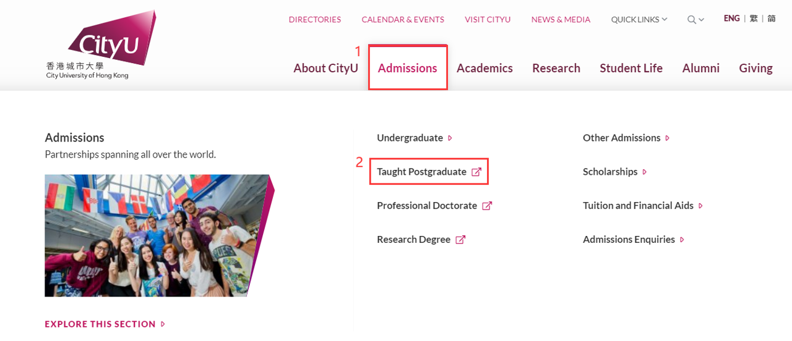
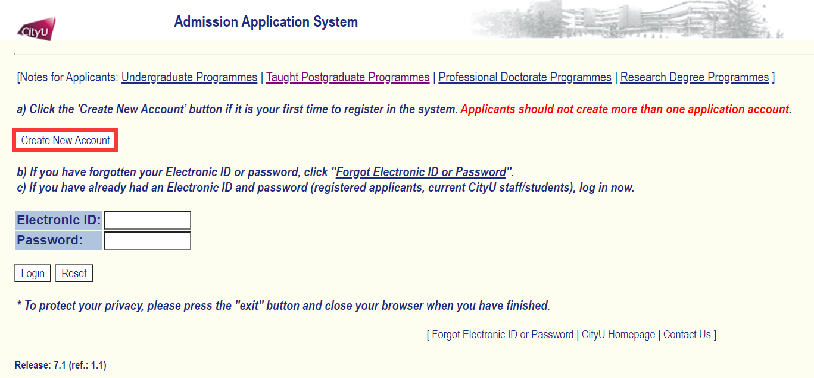
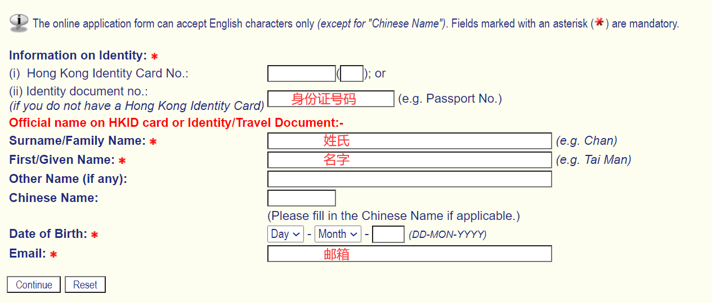
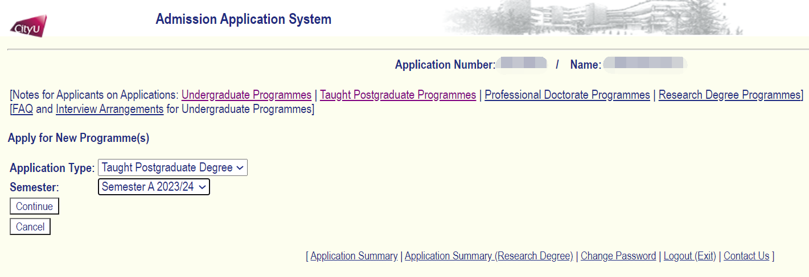
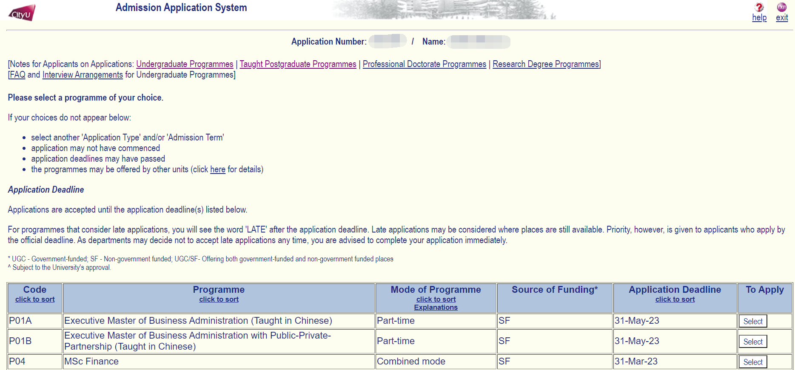
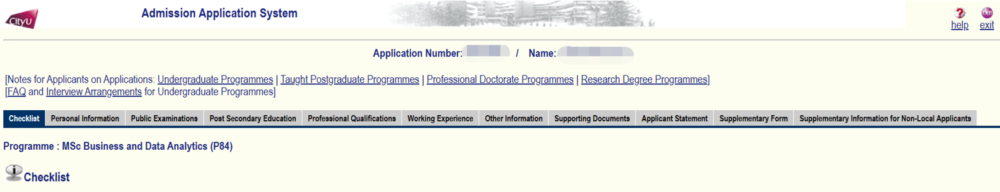
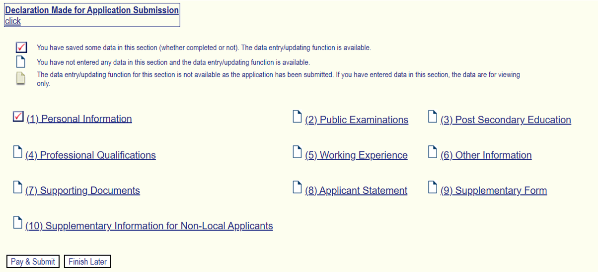

# CityU网申流程

## 访问网申页面
打开CityU主页：https://www.cityu.edu.hk/zh-cn ，如下：

1. 选择**Admissions**，
2. 选择**Taught Postgraduate**，进入新的页面，如下

1. 选择**Taught Postgraduate Programmes**，
2. 选择**Apply Now**，下划页面阅读申请注意事项，阅读完后点击**APPLY NOW**，我们将抵达网申页面。

## 注册账户
首先，点击**Create New Account**按钮，创建新的账户：

然后，填写如下信息：

记住你的申请编号，EID和密码。

## 创建新的申请

## 选择申请学院及项目

1. 选择**申请类型**和**学期**

2. 查看下方项目列表和截止日期，选择合适的项目，点击**Select**

进入新的页面，如下

点击**Checklist**，滑动至页面底部。提供了一份总的检查清单，用于缴费前的快速检查。

## 填写个人信息

## 填写考试成绩 DSE/GRE/语言

## 填写教育经历

## 填写获奖荣誉

## 填写工作经历

## 填写其他信息

## 上传证明文件

## 填写个人陈述
